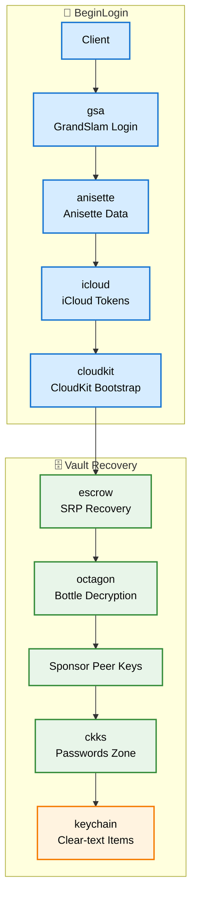

# appleservices

A Go library for Apple's private iCloud / keychain services. It signs in to an
Apple ID, joins the account's trust circle, and **decrypts your synced Passwords
in clear text**, no Apple device, no Wine, no browser automation.

```go
login, _  := appleservices.BeginLogin(creds, store) // sign in (handle 2FA once)
client, _ := login.Client()
pws, _    := client.WebPasswords(passcode)          // decrypt
for _, p := range pws {
    fmt.Println(p.Name, p.Domain, p.Username, p.Password, p.TOTP)
}
```

> ⚠️ **Use it only on an Apple ID you own.** This is an unofficial, clean-room
> reimplementation of Apple's private protocols (GrandSlam auth, CloudKit/CKKS,
> Octagon). It exists for personal data access and research. Nothing here talks
> to a service on your behalf beyond what you'd do signing in yourself.

## Install

```sh
go get github.com/Laky-64/appleservices
```

Pure Go. The only runtime dependency is an [anisette](https://github.com/SideStore/anisette-servers)
server for device-identity headers, the library uses the public pool by default.

## Quick start

```go
package main

import (
	"bufio"
	"fmt"
	"os"
	"strings"

	"github.com/Laky-64/appleservices"
)

func main() {
	creds := appleservices.Credentials{AppleID: "you@icloud.com", Password: "…"}
	store := &fileStore{dir: "./state"} // your Store (see below)

	login, err := appleservices.BeginLogin(creds, store)
	if err != nil {
		panic(err)
	}

	// First run needs a trusted-device code; later runs skip it.
	if login.NeedsTwoFactor() {
		login.RequestCode() // pushes a code to your trusted Apple devices
		fmt.Print("code: ")
		code, _ := bufio.NewReader(os.Stdin).ReadString('\n')
		login.SubmitCode(strings.TrimSpace(code))
	}

	client, _ := login.Client()

	pws, _ := client.WebPasswords("123456") // your device passcode
	for _, p := range pws {
		fmt.Printf("%-20s %-25s %s\n", p.Name, p.Username, p.Password)
	}
}
```

A complete runnable example (with a file-backed `Store`) lives in
[`cmd/passwords`](cmd/passwords).

## What you get

`WebPasswords` returns your Safari/AutoFill entries:

```go
type WebPassword struct {
	Name     string    // display title, e.g. "Stoattish Password"
	Domain   string    // primary site host (or an opaque id for a manual entry)
	Domains  []string  // every web domain the login covers, e.g. tim.it + timvision.it
	Website  bool      // true = website login, false = manually-added entry
	Username string
	Password string
	TOTP     string    // otpauth:// URL, if the entry has a verification code
	Created  time.Time
	Modified time.Time
}
```

Need the current 6-digit 2FA code? It's built in (RFC 6238):

```go
code, err := p.TOTPCode(time.Now()) // "773933"
```

One login can cover several sites, `Domains` lists them all (Apple lets you link,
say, `tim.it` and `timvision.it` to one entry). Apple stores no icons, so
`p.IconURL()` returns a favicon URL via DuckDuckGo's icon service
(`https://icons.duckduckgo.com/ip3/<domain>.ico`), reliable where a site's own
`/favicon.ico` 404s. The domain is sent to DuckDuckGo when you fetch it.

### Polling for new passwords

Escrow recovery is a rate-limited HSM call, so don't repeat it in a loop. Open the
vault once, then poll `WebPasswords`, each poll re-fetches CloudKit with no escrow
call and reflects entries added on the account's other devices:

```go
pv, _ := client.OpenPasswords(passcode) // escrow runs once here
for {
	pws, _ := pv.WebPasswords()          // cheap, CloudKit fetch only
	// … diff, notify …
	time.Sleep(30 * time.Minute)
}
```

### Multiple devices

On accounts with several trusted devices more than one recovery bottle can be
viable, each needing its own device's passcode. List them (a free call, no escrow
or passcode) and pick one:

```go
refs, _ := client.ViableBottles()
// show refs[i].Device (Model, Name, Serial, Build) and let the user choose
pv, _ := client.OpenPasswordsWith(refs[i], passcode)
```

The single-device case needs none of this, `WebPasswords` / `OpenPasswords` just
use the sole bottle.

### Skipping escrow on later runs

Escrow recovery yields a **sponsor peer key**, the P-384 key the vault is
actually opened with. Cache it and later runs skip escrow and the passcode
entirely:

```go
peer, _ := client.RecoverPeer(passcode) // once, the escrow round-trip
save(peer)                              // PeerKey{PeerID, PrivateKey}, encrypt it!

// every run after that:
pv, _ := client.OpenPasswordsWithPeer(load()) // no escrow, no passcode
```

The key stays valid across TLK rotations (the zone key is re-unwrapped from a
freshly fetched TLKShare each time). It stops working only when that peer leaves
the account's trust circle, i.e. the device was removed, so fall back to
`RecoverPeer` when `OpenPasswordsWithPeer` fails.

> 🔑 **A PeerKey is a master key.** It decrypts the whole keychain, forever,
> without the Apple ID password or the device passcode. Storing it in plaintext
> is the same as storing every password in plaintext. Put it in the OS credential
> store (DPAPI / Keychain / libsecret) or encrypt it under a local user unlock.

### Profile

`client.Profile()` returns the account holder's display name and profile photo
(the me-card contact photo, the same image the iCloud client shows) in one call,
no escrow or passcode needed:

```go
p, _ := client.Profile()
fmt.Println(p.Name)                    // "Steve Wozniak"
os.WriteFile("me.jpg", p.Photo, 0o600) // p.Photo is nil when no photo is set
```

Only the photo bytes are exposed, not the underlying URL: fetching it needs the
account's MobileMe auth + anisette headers, which a caller cannot reproduce.

## The Store (required)

The library never touches disk itself, you decide where its two pieces of state
live (a stable anisette **device identity**, and the GSA **trusted session** that
lets later logins skip 2FA). Implement this tiny interface with files, a DB, an OS
keychain, whatever:

```go
type Store interface {
	LoadDevice() (*Device, error);  SaveDevice(*Device) error
	LoadSession() (*Session, error); SaveSession(*Session) error
}

type Device  struct { Identifier, ProvisioningBlob []byte }
type Session struct { DSID string; Cookies []Cookie }
type Cookie  struct { URL, Name, Value string }
```

A trivial file backend (JSON, 0600), see `cmd/passwords/filestore.go`:

```go
func (s fileStore) SaveDevice(d *appleservices.Device) error {
	b, _ := json.Marshal(d)
	return os.WriteFile(filepath.Join(s.dir, "device.json"), b, 0o600)
}
```

## Notes

- **Two-factor is trusted-device only** (never SMS): SMS 2FA does not grant the
  Octagon trust needed to read the keychain, so the API doesn't offer it.
- **Apple ID + password are needed on every run.** The stored session only skips
  the 2FA *code prompt*, the password itself can't be avoided (both the GrandSlam
  login and the escrow recovery authenticate with it). Persist it in your own app
  behind a local unlock if you want convenience; the library won't store it for you.
- The **device passcode** is what recovers the account's escrow key. It's passed
  per call and never stored.

## How it works



The library is layered: import a single stage (e.g. `gsa`, `ckks`) directly, or
use the `appleservices` facade shown above.

## Status

Recovers **web passwords** (and their titles + TOTP codes) end-to-end. WiFi
passwords, credit cards, passkeys and other keychain classes decrypt through the
same `ckks` path and are a small decoder away.

## License

[MIT](LICENSE). No warranty. Not affiliated with Apple, use it on accounts you own.
